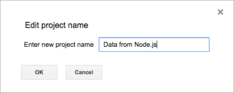
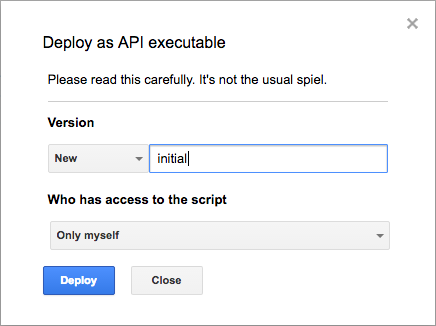
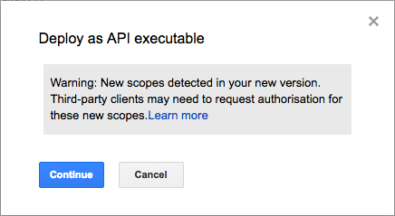
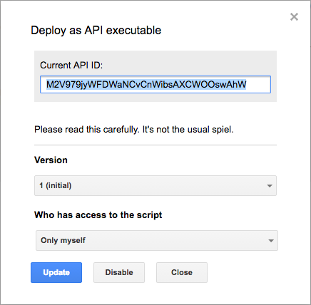
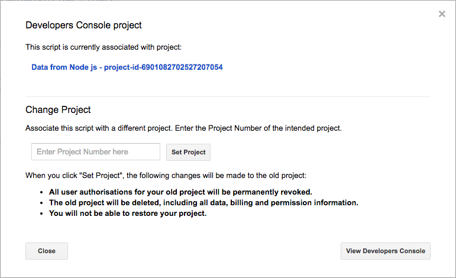
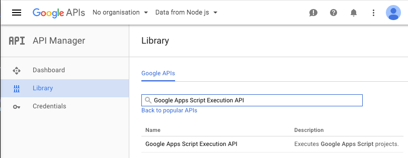
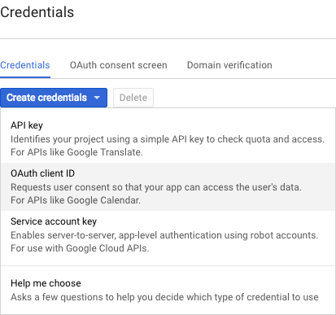
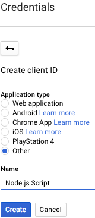
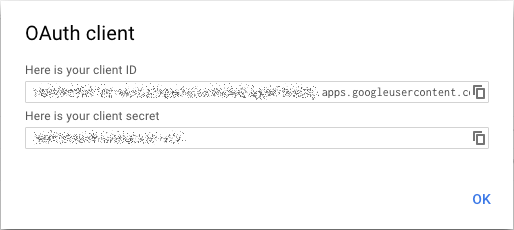

## Google Apps Script API

### About
This tiny library is designed to call Google Apps Script API
from node.js.

### Usage
As an sample we show how to add rows to Google Spreadsheet
from node.js script.   

 1. Open [Google Drive](https://drive.google.com)
 1. Create new Spreadsheet.
 1. From a Spreadsheet open Script editor  
    (menu: *↦ Tools →  Script editor...*)
 1. Replace content of tab _Code.gs_ by:
    ```javascript
    // @OnlyCurrentDoc
    function insertRow(atPosition, rows) {
      var sheet = SpreadsheetApp.getActiveSpreadsheet().getSheets()[0];
     
      if (Array.isArray(atPosition)) {
        rows = atPosition;
        atPosition = sheet.getLastRow() + 1;
      }
      else if (atPosition <= 0) atPosition += sheet.getLastRow() + 1;
      if (!Array.isArray(rows[0])) rows = [rows];
      if (atPosition <= sheet.getLastRow()) {
        sheet.insertRowsBefore(atPosition, rows.length);
      }
        
      sheet.getRange(atPosition, 1, rows.length, rows[0].length).setValues(rows);
      
      return {
        rowsCountAfterInsertion: sheet.getLastRow(),
        insertedRowsCount: rows.length
      };
    }
    ```
    > **Node:** Annotation comments _@OnlyCurrentDoc_ tells to google that _SpreasheetApp_ will use only active spreadsheet.  
      It means more strict authorization permission (`https://www.googleapis.com/auth/spreadsheets.currentonly`
      instead of `https://www.googleapis.com/auth/spreadsheets`).
 1. Choose project name on first saving (*↦ File → Save*)  
	  
	Project name on this turorial is **Data from Node.js**.
 1. Deploy script (*↦ Publish → Deploy as API executable...*)  
    * In dialog _Deploy as API executable_ in section version fill some note, then press ___Deploy___.   
      
    * Then displays warning that new scopes may need to authorisation.
      Press button ___Continue___.  
      
    * After that dialog shows _Current API ID_. You will need it later to identify called script.  
      Copy it an close dialog by button ___Close___.  
      
    * You can configure script API ID to environment variable: `export SCRIPT_ID='<Current API ID>'`  
 1. Enable __Google Apps Script Execution API__
    * Open _Project Console_. Menu *↦ Resources → Developers Console project...*, then click on blue link  
      .
    * In the _Library_ find _Google API_ by name `Google Apps Script Execution API`.  
        
      Then click on API name in search result.
    * Enable API by pressing .
 1. Create credentials for Node.js script.
    * In _Project Console_ choose on left panel _Credentials_.
      You can already see OAuth 2.0 client ID for Apps Script.
    * Press ___Create credentials___ and choose ___OAuth client ID___  
      .
    * _Application Type_ choose option ___Other___ and give some meaningful name  
      > .
    * Then press ___Create___ and dialog with `client ID` and `client secret` appears  
        
      We will need this values later.
 1. Install _Google Apps Script API_ to your project.  
    In you project dir enter command: `npm install solargis/gas-api --save`
 1. Create authorities by entering command: `npm explore gas-api -- npm run create`
    * Script will ask you form `client ID` and `client secret` which we created in 8th step,
    * then let you choose a permissions. Enter `6`-_View and manage spreadsheets that this application has been installed in_.
    * Press enter again to end choosing selection and open printed URL in browser.
    * In browser review and ___Allow___ permissions  
      
    * Then copy result code back tu script.
    * Script prints environment variable `GOOGLE_AUTH` at last line and also to `.env` file.
    * Apply environment settings by command `. .env`.
 1. Create file `index.js` with following content:
    ```javascript
    var GoogleAppsScriptAPI = require('gas-api');
    
    var gscript = new GoogleAppsScriptAPI();
    gscript.setAccessTokenCache(".auth/access-token.json");
    gscript.run({
    	scriptId: process.env.SCRIPT_ID,
    	//devMode: true,
    	function: 'insertRow',
    	parameters: [[process.env.USER, new Date().getMinutes(), '=YEAR(NOW())-R[0]C[-1]']]
    }, function (err, response) {
    	if (err) {
    		if (err instanceof Error) {
    			console.log(err);
    			if (response) console.log(JSON.stringify(response, null, 2));
    		}
    		else console.log("Error: " + JSON.stringify(err, null, 2));
    	}
    	else console.log(response);
    });
    ```
    > **Note:** Optional parameter `devMode=true` of run method, can be used when you change script and
      want not deploy it. But after 
 1. Execute script by command `node index.js` and check Spreadshseet if a new line was actually added.
   
### Troubleshooting
 * If your script prints error:
   ```json
   Error: {
     "code": 404,
     "message": "Requested entity was not found.",
     "status": "NOT_FOUND"
   }
   ```
   * Check if you have valid `scriptId`.
   * Try remove optional parameter `devMode=true` if you use it.  
